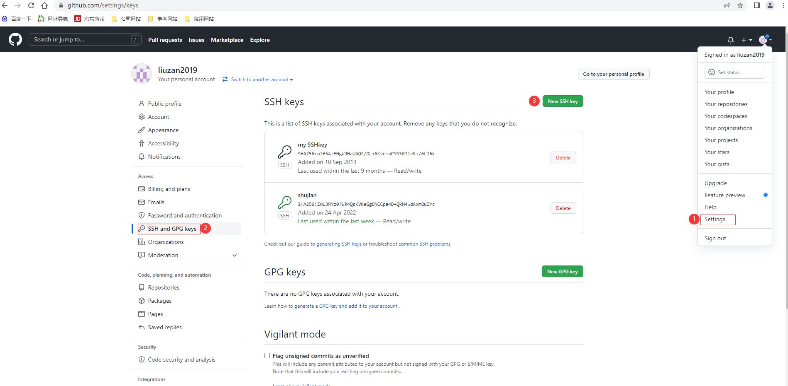

## 学习链接：

https://www.cnblogs.com/codinghard/p/15647752.html

https://wenku.baidu.com/view/e6ad1208b7daa58da0116c175f0e7cd1842518e4.html

## 问题发现及解决问题历程：

1. 使用git 向github 推送代码超时 --> ==**问题发现**==
2. 在浏览器中发现GitHub网站访问失败
3. ==解决问题1==  --> [解决浏览器访问失败](./Github Connection failure.md#背景)
4. 再推送代码，发现报OpenSSL_read失败
5. ==解决问题2==  --> [解决OpenSSL_read失败](#解决办法) 
6. 推送成功

## 解决办法：

### 打开项目.git 文件夹，修改config文件

> 将 `url = https://github.com/liuzan2019/myblog.git` 修改为 `url = git@github.com:liuzan2019/myblog.git`

### 生成RSA密钥对

使用`ssh-keygen`命令生成RSA密钥，命令如下：

 ````shell
  ssh-keygen -t rsa -b 4096 -C "your_email@example.com" 
 ````

### 将publickey添加到github

|  |
| ------------------------------------------------------------ |

